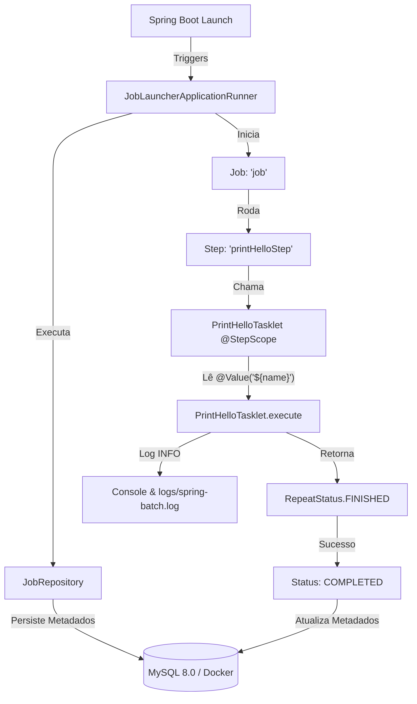

# Hello World - Spring Batch

[](https://oracle.com/java)
[](https://spring.io/projects/spring-boot)
[](https://spring.io/projects/spring-batch)
[](https://www.mysql.com/)
[](https://www.docker.com/)

Projeto demonstrativo de um pipeline inicial com **Spring Batch 5**, utilizando **Java 21**, **Spring Boot 3.5.16** e persistência de metadados em banco de dados **MySQL** via **Docker Compose**.

---

## 📌 Visão Geral

Este repositório serve como base limpa e moderna para o desenvolvimento de processamentos em lote (*batch processing*). A aplicação executa uma `Job` composta por um `Step` único do tipo `Tasklet`, que lê parâmetros configurados e gera logs formatados via **SLF4J**, mantendo a retenção do histórico tanto em banco de dados quanto em arquivos `.log`.

### Destaques do Projeto:
* **Spring Batch 5 Standards:** Configuração baseada em métodos *package-private* e encadeamento via `JobBuilder` e `StepBuilder`.
* **Registro Automático de Jobs:** Eliminação de rotinas obsoletas como `JobRegistryBeanPostProcessor`.
* **Dockerizado:** Container MySQL 8.0 na porta `3307` e phpMyAdmin na porta `5050`.
* **Logs Peristidos:** Saída simultânea no terminal e salvamento dinâmico no diretório `logs/spring-batch.log`.

---

## 🏗️ Arquitetura e Fluxo de Execução

O diagrama abaixo descreve a interação entre os componentes internos do Spring Batch durante o ciclo de vida do job:


## 🛠️ Tecnologias Utilizadas

* **Java 21**
* **Spring Boot 3.5.16**
* **Spring Batch (Starter Batch)**
* **Spring Web**
* **MySQL 8.0**
* **Docker & Docker Compose**
* **SLF4J / Logback**
* **Maven**

---

## 🚀 Como Executar o Projeto

### Pré-requisitos
* **JDK 21** instalado.
* **Maven 3.8+** instalado (or via Wrapper).
* **Docker & Docker Compose** em execução.

---

### 1. Subir o Banco de Dados (MySQL)
No terminal, navegue até a raiz do projeto e inicie os contêineres:

```bash
docker-compose up -d
```
> **Acessos úteis:**
> * **MySQL Server:** `localhost:3307` (Usuário: `user`, Senha: `1234567`)
> * **phpMyAdmin:** `http://localhost:5050`

---

### 2. Executar a Aplicação
Instale as dependências e rode o projeto via Maven:

```bash
mvn spring-boot:run
```
Ou execute a classe principal `HelloWorldSpringBatchApplication.java` diretamente pela sua IDE (STS, IntelliJ, VS Code).

---

## 📊 Configuração e Variáveis de Ambiente

As configurações de banco de dados e logs estão parametrizadas em `src/main/resources/application.properties`:

| Propriedade | Padrão Local | Descrição |
| :--- | :--- | :--- |
| `spring.datasource.url` | `jdbc:mysql://localhost:3307/spring_batch...` | URL de conexão JDBC |
| `spring.datasource.username` | `${DB_USERNAME:root}` | Usuário do MySQL |
| `spring.datasource.password` | `${DB_PASSWORD:1234567}` | Senha do MySQL |
| `logging.file.name` | `logs/spring-batch.log` | Caminho do arquivo de saída dos logs |

---

## 📝 Saída Esperada no Log

Ao finalizar o processamento com sucesso, o console apresentará os seguintes registros:

```text
INFO --- [hello-world-spring-batch] [main] o.s.b.c.l.s.TaskExecutorJobLauncher     : Job: [SimpleJob: [name=job]] launched with the following parameters: [{'run.id':'{value=1...}'}]
INFO --- [hello-world-spring-batch] [main] o.s.batch.core.job.SimpleStepHandler    : Executing step: [printHelloStep]
INFO --- [hello-world-spring-batch] [main] c.t.h.tasklet.PrintHelloTasklet         : Olá Edson !
INFO --- [hello-world-spring-batch] [main] o.s.batch.core.step.AbstractStep        : Step: [printHelloStep] executed in 29ms
INFO --- [hello-world-spring-batch] [main] o.s.b.c.l.s.TaskExecutorJobLauncher     : Job: [SimpleJob: [name=job]] completed with status: [COMPLETED]
```
